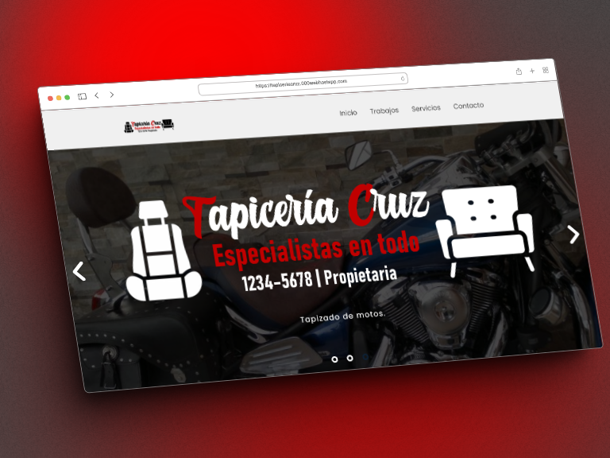
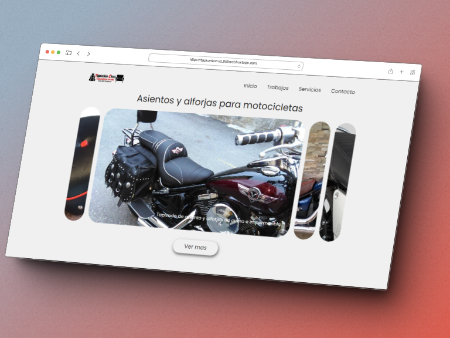
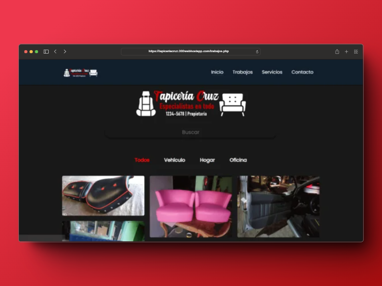

# 🛠 Upholstery WebSite 🛠
Website for upholstery, with connection to a database to manage the work.
It also has an administration module for the site where you can do CRUD. In addition to being a site adapted to dark and light mode, it is completely responsive.
[Look at the website](https://tapiceriacruz.000webhostapp.com)

## Authors

- [@DianaCruz](https://github.com/dianacruzpro)

## 🔧Tech Stack

**Client:** 🟠HTML5 | 🔵CSS3 | 🟡JavaScript

**Server:** 🟣PHP | 🔵MySQL

Give a ⭐ if you like this website!
<br>

## Screenshots
<div align="center">
  <a href="https://tapiceriacruz.000webhostapp.com" title="Upholstery WebSite | Diana Cruz">
      </img>
      </img>
      </img>
      </img>
  </a>
</div>


## How to use the site

- ✔ Download the repository with followin link: [Tapiceria-Cruz](https://github.com/DianaVCruz/SitioWeb-Tapiceria/archive/refs/heads/main.zip)
- ✔ Open xampp and create the database in phpMyAdmin:
```SQL
# table structure `products`

CREATE TABLE `products` (
  `id_product` int(11) NOT NULL,
  `name_product` text DEFAULT NULL,
  `description_product` text DEFAULT NULL,
  `img_antes` text NOT NULL,
  `img_despues` text NOT NULL,
  `category_product` text NOT NULL,
  `label__product` text NOT NULL
) ENGINE=InnoDB DEFAULT CHARSET=utf8;


#Data for the table `products`

INSERT INTO `products` (`id_product`, `name_product`, `description_product`, `img_antes`, `img_despues`, `category_product`, `label__product`) VALUES
(1, 'Mueble Azul Tapizado', 'Tapizado de mueble de sala azul', '1660084559_servicio-mueble1.png', '1660084559_servicio-mueble1.png', 'hogar', 'Sillon Sala Mueble Hogar Oficina'),
(2, 'Mueble de esquina', 'Retapizado de mueble para esquina azul', '1660084659_mueble1.jpg', '1660084659_mueble1.jpg', 'oficina', 'Mueble oficina sillon sillón sala juego de muebles'),
(3, 'Puertas de carro', 'Retapizado de puertas para carro', '1660085018_mueble3.jpg', '1660085018_tapizado3.jpg', 'vehículo', 'carro puertas puerta vehículo vehiculo autos'),
(4, 'Sillones para salón de belleza', 'Tapizado de sillones para salon de belleza', '1660086708_tapizado4.jpg', '1660086708_tapizado4.jpg', 'oficina', 'Sillones sillon sillón salon de belleza muebles'),
(5, 'Asiento de moto', 'Retapizado de asiento para moto con materia impermeable.', '1660086971_m10_1.jpg', '1660086971_m10_2.jpg', 'vehículo', 'asiento de moto');

# table indices `products`

ALTER TABLE `products`
  ADD PRIMARY KEY (`id_product`);


# AUTO_INCREMENT of table `products`

ALTER TABLE `products`
  MODIFY `id_product` int(11) NOT NULL AUTO_INCREMENT, AUTO_INCREMENT=0;
```
- ✔ Create a virtual domain for the project in the files "C:\xampp\apache\conf\extra\httpd-vhosts.conf" and "C:\Windows\System32\drivers\etc\hosts".
- ✔ Done! Open the project in the browser with the domain you created. 😊
- ✔ 😲 Oh! I almost forget it. To access the administrator, click on the logo in the navigation bar and enter the credentials: Username: Diana Cruz, Password: tCruz08.
-😉 Anyway, you can change the credentials in "administrador/index.php" (line: 4 and 7).
